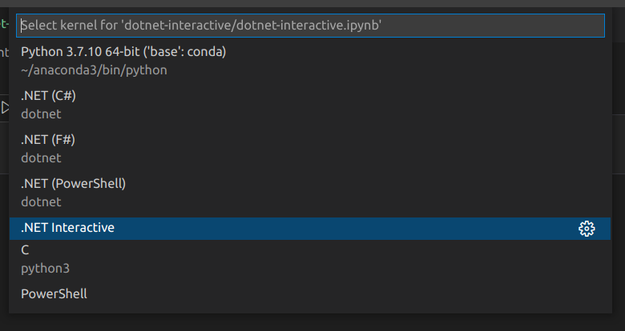

# .NET Interactive

>.NET Interactive [[GitHub](https://github.com/dotnet/interactive)] takes the power of .NET and embeds it into your interactive experiences. Share code, explore data, write, and learn across your apps in ways you couldn’t before.

.NET Interactive takes the the scripting versions of C# and F# and rolls them up into a Jupyter Notebook kernel (with PowerShell scripting of course).

For more information, [my notes](./dotnet-interactive.ipynb) are here.

@[BryanWilhite](https://twitter.com/BryanWilhite)
