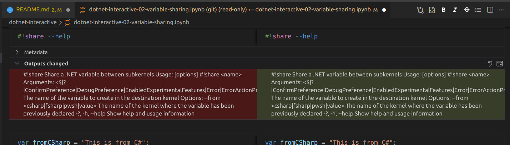
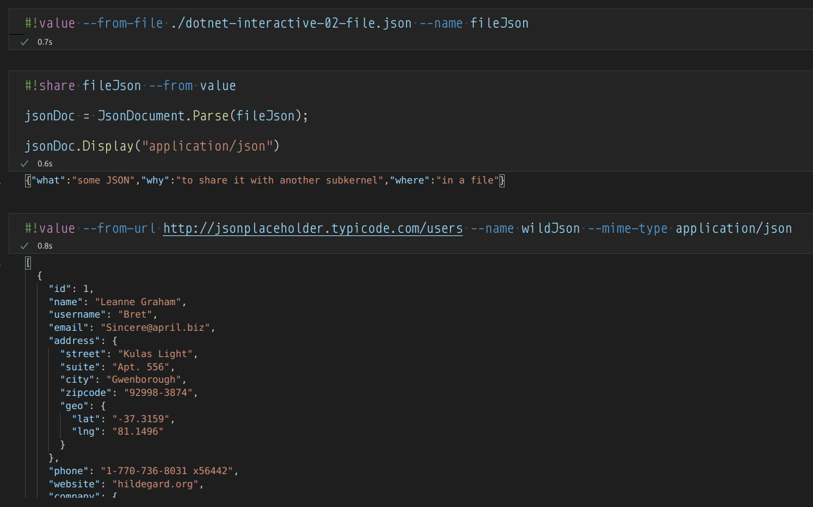
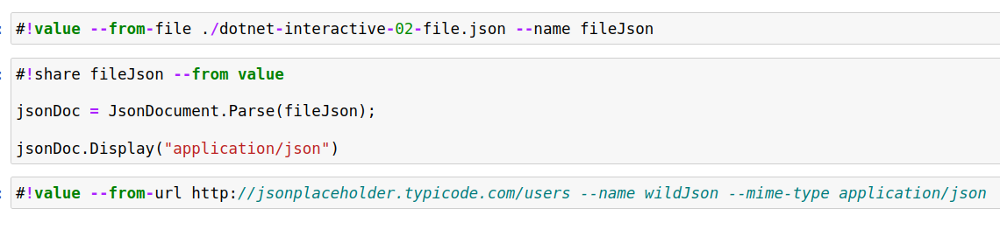
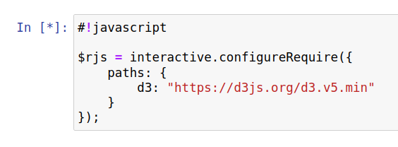

# .NET Interactive

>.NET Interactive [[GitHub](https://github.com/dotnet/interactive)] takes the power of .NET and embeds it into your interactive experiences. Share code, explore data, write, and learn across your apps in ways you couldn’t before.

.NET Interactive takes the the scripting versions of C# and F# and rolls them up into a Jupyter Notebook kernel (with PowerShell scripting of course).

For more information, [my notes](./dotnet-interactive.ipynb) are here.

## Visual Studio Code extensions and Anaconda

The following Visual Studio Code extension is required:

- [.NET Interactive Notebooks](https://marketplace.visualstudio.com/items?itemName=ms-dotnettools.dotnet-interactive-vscode) (still in preview)

The [Jupyter extension](https://marketplace.visualstudio.com/items?itemName=ms-toolsai.jupyter) is not required (I think) but is highly recommended—as well as [the Markdown extensions recommended by Microsoft](https://code.visualstudio.com/Docs/languages/markdown).

In order to test `*.ipynb` files in the browser with the `jupyter notebook` command, installing [Anaconda](https://www.anaconda.com/) might be overkill but I recommend it.

## known issues

The following issues might already be among or need to be added to [over 200 issues on GitHub](https://github.com/dotnet/interactive/issues):

### notebooks are modified simply by opening them

Opening an `*.ipynb` file in Visual Studio Code or in the browser with the `jupyter notebook` command might modify the file. Predominantly, cell outputs are being modified:

### cell output for `#!value` sharing is not displayed in the browser

In the browser with the `jupyter notebook` command and without regard to notebook trust, cell output for `#!value` sharing is not displayed:

| in Visual Studio Code | in browser |
|- |-
|  |  |

The [variable-sharing notebook](./dotnet-interactive-02-variable-sharing.ipynb) in this study should demonstrate this issue.

### `interactive.configureRequire` fails to run in the browser

Without regard to notebook trust, a cell with `interactive.configureRequire` hangs with an asterisk in the browser:

There are no relevant error messages in the F12 console of the browser. The [RequireJS notebook](./dotnet-interactive-05-requirejs.ipynb) in this study should demonstrate this issue.

### the browser does not infer the .NET Interactive sub-kernel correctly in all cases

The Visual Studio Code experience might encourage the omission of explicitly specifying the cell type with a magics declaration (e.g. `#!csharp`, `#!fsharp`, etc.). Examples of this need are in the following notebooks:

- [`dotnet-interactive-04-interactive-object.ipynb`](./dotnet-interactive-04-interactive-object.ipynb)
- [`dotnet-interactive-06-fsharp-datavis.ipynb`](./dotnet-interactive-06-fsharp-datavis.ipynb)

@[BryanWilhite](https://twitter.com/BryanWilhite)
